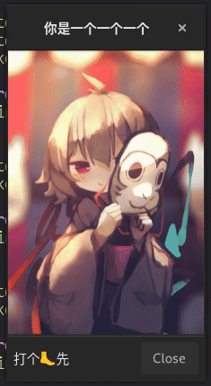
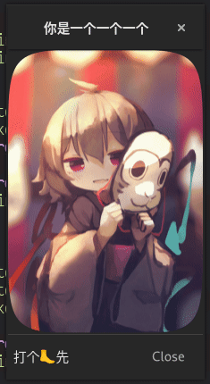
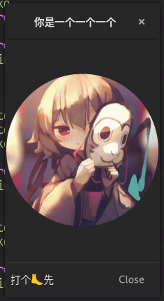
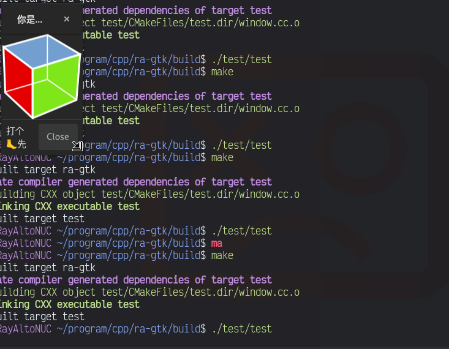
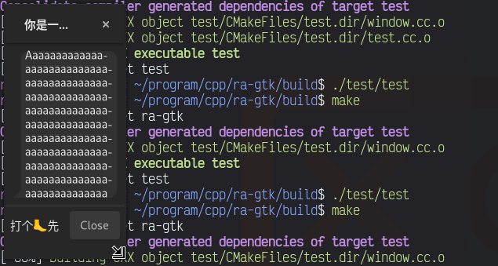
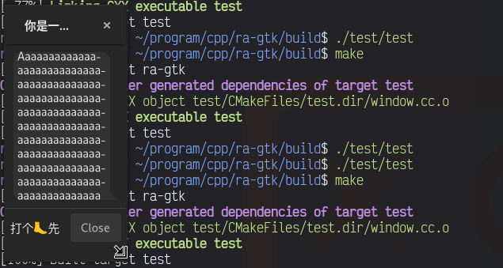
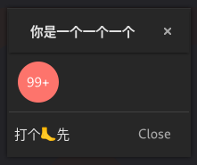

# RA-Gtk

RayAlto's Stupid Self-taught Noob Custom Gtk Widgets

## Examples

### `rayalto::gtk::widget::Image`

A simple extension to `Gtk::Image`

- Animated image like gif will be played automatically:

- There are three variants:

| `Image::Shape::RECTANGLE`                                                  | `Image::Shape::ROUNDED`                                              | `Image::Shape::CIRCLE`                                            |
| -------------------------------------------------------------------------- | -------------------------------------------------------------------- | ----------------------------------------------------------------- |
|  |  |  |

- Scaling on vector image like svg is lossless, `Image` will load svg text into memory and generate pixbuf use the text in specified size every time while scaling:

### `rayalto::gtk::widget::MessageBubble`

A simple message bubble

| `MessageBubble::Side::LEFT`                                                                  | `MessageBubble::Side::RIGHT`                                                                    |
| -------------------------------------------------------------------------------------------- | ----------------------------------------------------------------------------------------------- |
|  |  |

### `rayalto::gtk::widget::RedDot`

A simple red dot

